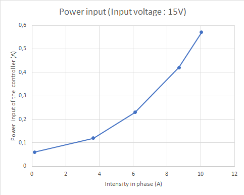
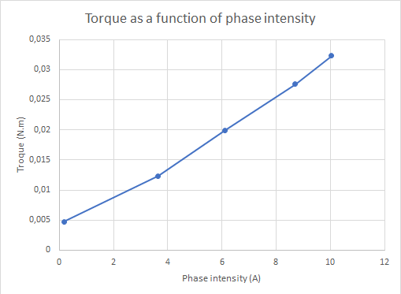
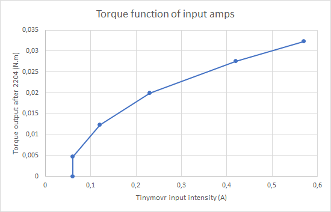
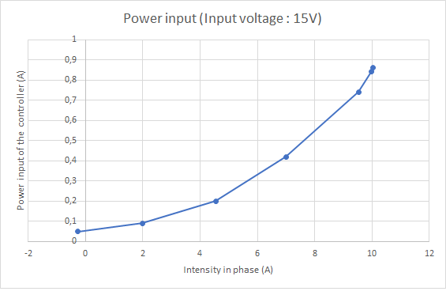
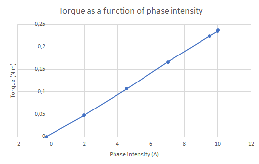
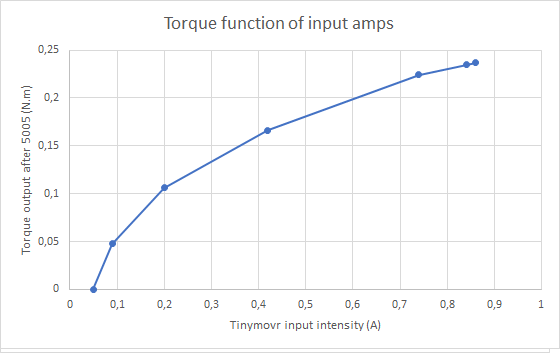

# Help to design BLDC articulations
BLDC controllers are very new with respect the classical DC motor controllers, mainly taking into account position control. The objective of this repo is to gather studies to help design of robots (small and big) with BLDC.

## Motors

|                     |Motor 1 |Motor 2|
| ------------------- |:------:|:-----:|
|Picture|||
| Ref| [Eachine  2204-2300KV](https://www.eachine.com/Eachine-Racer-250-Drone-Spare-Part-BG2204-2300KV-Brushless-Motor-CW-or-CCW-p-343.html)|[MAD component 5005-280KV](https://mad-motor.com/product/mad-5005-eee/)|
|Resistance/phase(milliOhms)|170|230|
|Inductance/phase(microHenri)|10|76|
|Outer diameter(mm)|28|56|
|Max amps in coals|12 A|18 A|
|Purpose|Fast/silent animatronics (eye)|Powerful robotic articulation|

-----
## Tinymovr controller

[Documentation](https://tinymovr.readthedocs.io/en/latest/)
Here, the tinymovr controller board is powered by a DC power supply 15V - 10A.
The communication is done via a standard FTDI USB - UART device (for experiment purpose here... Later via CAN bus)

-----

### A small motor (2204-2300KV) + Tinymovr controller - push test

the motor is set next to a weighing scale with a lever arm of 95mm. 
Input voltage : 15V.

#### Measures

| Position target (ticks)| Phase amps (A)| Input amps (A)| weight (g)|torque (N.m)|
| ---------------------- |:-------------:| -------------:|----------:|-----------:|
| 0                      | 0.918         | 0.060         |0          |0.000       |
| 1000                   | -0.165        | 0.060         |5          |0.005       |
| 2000                   | -3.640        | 0.120         |13         |0.012       |
| 3000                   | -6.112        | 0.230         |21         |0.020       |
| 4000                   | -8.710        | 0.420         |29         |0.028       |
| 5000                   | -10.040       | 0.570         |34         |0.032       |

Find below the input intensity of the Tinymovr controller function of the intensity delivered in coals.

Find below the torque generated by the motor function of the intensity delivered in coals

Kc = Torque/Iphase = 0.032/10.04 = 0.0032 N.m/A

Kv = 1/Kc = 310.8 rad/s/V

KV = 2970 rpm/V

And find below the torque produced function of input intensity

### A bigger motor (5005-280KV) + Tinymovr controller - push test

the motor is set next to a weighing scale with a lever arm of 98mm. 
Input voltage : 15V.

#### Measures

| Position target (ticks)| Phase amps (A)| Input amps (A)| weight (g)|torque (N.m)|
| ---------------------- |:-------------:| -------------:|----------:|-----------:|
| 0                      | 0.277         | 0.050         |0          |0.000       |
| 1000                   | -1.983        | 0.090         |50         |0.048       |
| 2000                   | -4.547        | 0.200         |112        |0.106       |
| 3000                   | -6.995        | 0.420         |175        |0.166       |
| 4000                   | -9.527        | 0.740         |236        |0.224       |
| 5000                   | -9.973        | 0.840         |247        |0.235       |
| 6000                   | -10.025       | 0.860         |249        |0.237       |

Find below the input intensity of the Tinymovr controller function of the intensity delivered in coals.

Find below the torque generated by the motor function of the intensity delivered in coals

Kc = Torque/Iphase = 0.032/10.04 = 0.0234 N.m/A

Kv = 1/Kc = 42.7 rad/s/V

KV = 407 rpm/V

And find below the torque produced function of input intensity

----

### A small motor (2204-2300KV) + Tinymovr controller - speed test
the motor is without load

| Speed target (ticks/s)| Input amps (A)| Measured speed (ticks/s)|
| ------------------- |:-------------:| -----------------------:|
| 0                   | 0.060         | 168                     |
| 7000                | 0.060         | 506                     |
| 8000                | 0.060         | 2373                    |
| 10000               | 0.060         | 9880                    |
| 20000               | 0.060         | 17605                   |
| 40000               | 0.060         | 38343                   |
| 80000               | 0.060         | 79606                   |
| 160000              | 0.070         | 147904                  |
| 320000              | 0.080         | 278386                  |
| 640000              | 0.090         | 281503                  |

### A bigger motor (2204-2300KV) + Tinymovr controller - speed test
the motor is without load

| Speed target (ticks/s)| Input amps (A)| Measured speed (ticks/s)|
| ------------------- |:-------------:| -------------------------:|
| 0                   | 0.060         | -0                        |
| 5000                | 0.060         | -292                      |
| 6000                | 0.060         | 4173                      |
| 7000                | 0.060         | 4915                      |
| 8000                | 0.060         | 5408                      |
| 9000                | 0.060         | 7836                      |
| 10000               | 0.060         | 8835                      |
| 20000               | 0.090         | 75905                     |
| 160000              | 0.140         | 166808                    |
| 320000              | 0.470         | 270000                    |
